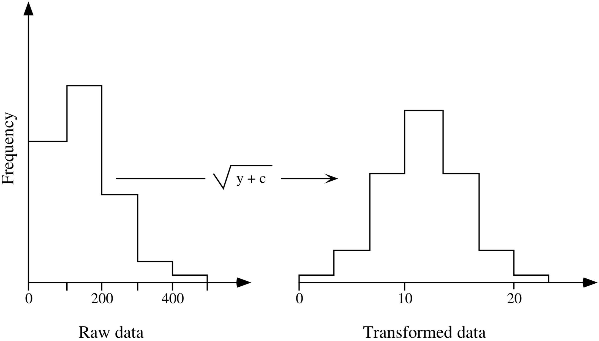
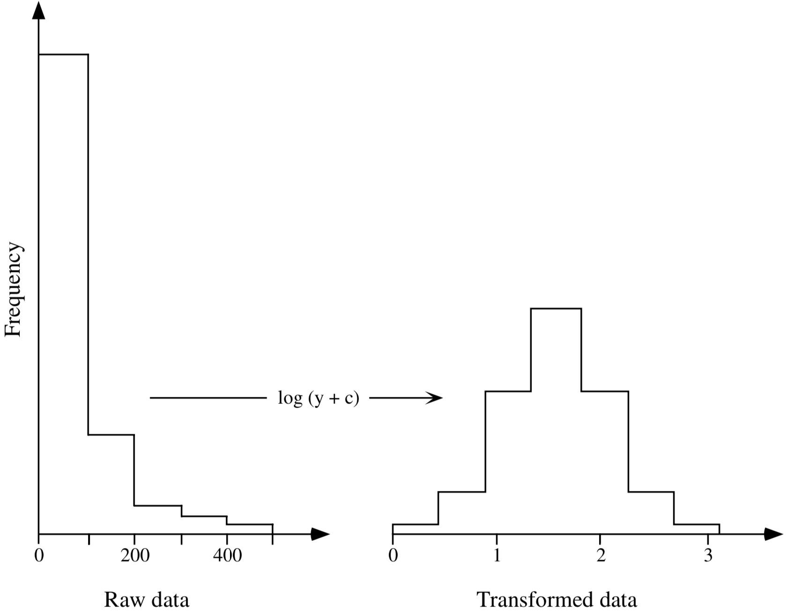

```{r setup, include=FALSE}
knitr::opts_chunk$set(echo = TRUE)
```


# **Sobre este curso y sus datos**

Los datos que utilizarán en este curso fueron usados en la tesis doctoral de Verneaux (Verneaux et al. 2003). Él propuso que se podian usar algunas especies de peces para caracterizar zonas ecologicas a lo largo de rios y arroyos en Europa. Verneaux demostró que las comunidades de peces eran buenos indicadores biológicos para estos cuerpos de agua. En este curso vamos a tratar de llegar a la misma conclusión

Los datos consisten en 3 matrices que contienen parte de los datos usados por Verneaux. Estos datos han sido colectados de 30 sitios a lo largo del rio *Doubs*, el cual corre entre Francia y Suiza en las montañas Jura. La primera matriz (*spe*) de datos contiene las abundancias de 27 especies de peces, la segunda matriz (*env*) contiene 11 variables ambientales relacionadas con la hidrología, geomoforlogía y quimica del rio. La tercera matriz (*spa*) contiene las coordenadas geográficas (Cartesianas, X y Y) de los sitios. 

# **Análisis exploratorio de los datos**

Los análisis exploratorios son métodos que usan herramientas de visualización y calcula descriptores sintéticos que son requeridos para ganar información referente a:

  * Tener una visión global de los datos
  * Transformar o recodificar algunas variables
  * Orientar analisis futuros

## Exploración de los datos *Doubs* 

Al comienzo de cada sesión de trabajo se recomienda definir el directorio o carpeta de trabajo. Si se usa Rstudio, el directorio de trabajo se puede definir yendo a:

  * Sesión
    * Definir directorio de trabajo
      * Escojer directorio 

En la consola de se puede definir de la siguente manera:

```{r SetDir, eval=FALSE, include=TRUE}
setwd('/direccion/de/la/carpeta/de/trabajo/')
```

Una vez definido el directorio de trabajo vamos a cargar los datos.
```{r loadData, echo=TRUE}
# Importar los datos desde archivos de texto, ej. formato CSV 
# ************************************************************
# Matriz de las especies de peces (data frame de las abundancias de los peces):
spe <- read.csv('../data/DoubsSpe.csv',row.names=1)
# Matriz de los datos ambientales:
env <- read.csv('../data/DoubsEnv.csv',row.names=1)
# Matriz de la informacion espacial (Coordenadas geograficas X,Y):
spa <- read.csv('../data/DoubsSpa.csv',row.names=1)
```

Echemos un vistazo a los datos de la comunidad (objeto **spe**, abundancia de los peces)

```{r speExplore1, eval=FALSE, include=TRUE}
# funciones básicas
# *****************
# Muestra el data frame completo (No recomendado para set de datos grandes):
spe
# Muestra solamente las primeras 5 lineas:
head(spe)
```
```{r speExplore, echo=TRUE}
# Muestra la dimensión del datafrmae (No. filas, No. columnas):
dim(spe)
# Muestra el No. de filas:
nrow(spe)
# Muestra el No. columnas:
ncol(spe)
# Muestra solamente 5 filas y 10 columnas:
spe[1:5,1:10]
# Nombre de las columnas  (descriptores = especies):
colnames(spe)
# Nombre de las filas
rownames(spe)
```
```{r speSummary, eval=FALSE, include=TRUE}
# Estadisticos descriptivos para las columnas
summary(spe)
```
```{r speExplore2, echo=FALSE}
summary(spe[,1:4])
```
### **Usando la mediana y la media de las abundancias. Las distribuciones son simétricas?**
```{r speExplore3, echo=TRUE}
# Distribución general de las abunancias
# **************************************
# Mínimo y máximo valor de las abundancias de todo el set de datos:
range(spe)
# Número de especies ausentes 
sum(spe==0)
# Proporción de ceros en el set de datos
sum(spe==0)/(nrow(spe)*ncol(spe))
# Conteo de especies con 0,1,2,3 o n de abundancia (clases) 
ab <- table(unlist(spe))
# Diagrama de barras de la distribución de abundancia de las especies
barplot(ab,las=1,xlab="Clases de abundancia",ylab="Frecuencia",co=gray(5:0/5))
```

**Fig. 1** Diagrama de barras de las clases de abundancia

## **Mirando el diagrama de barras sobre las clases de abundancia, cómo se interpretaría la alta frecuencia de ceros (ausencias) en el set de datos?**

Ahora usemos los datos geograficos para generar una representación gráfica de la ubicacion de los sitios de muestreo.

```{r echo=TRUE}
# Mapear la posición de los sitios
# ********************************
# 1. Creamos un lienzo en blanco donde estarán los puntos de muestreo
plot(spa,type='n',main="Localizacion de los sitios de muestreo",
     xlab="Coordenada X (km)",ylab="Coordenada Y (km)")
# 2. Adicionamos una linea que conecta los puntos de muestreo (simulemos el rio)
lines(spa,col="light blue",lwd=11)
# 3. Adicionamos los puntos de muestreo
text(spa, rownames(spa),cex=0.8,col="red")
# 4. Adicionamos la direccion del rio
text(50,10,"Corriente arriba",cex=0.8,col="red")
text(30,120,"Corriente abajo",cex=0.8,col="red")
```

**Fig. 2** Mapa de los 30 sitios de muestreo en el rio *Doubs*

Ahora que le hemos dado vida al rio ya podemos ubicar los peces y su distribución sobre el.
Vamos a plotear algunas de las especies de peces que seleccionó Verneaux. El por qué de estas especies lo veremos más adelante en la guía y tal véz generemos nuevos y más interesantes plots :).

```{r echo=TRUE}
# Mapas de las abundancias de algunos de las especies de peces
# ***************************************************************
# 1. Dividimos la ventana de graficos en 4 (para plotear 4 figuras a la vez)
par(mfrow=c(2,2),mai=c(0.7,0.7,0.4,0.4))
# 2. Ploteamos... (cex es usado para definir el tamaño de algún item en la gráfica)
# Trucha café
plot(spa,col="brown",cex=spe$TRU,main="Trucha café",
     xlab="Coordenada X (km)",ylab="Coordenada Y (km)")
lines(spa,col="light blue",lwd=1)
# Grayling
plot(spa,col="brown",cex=spe$OMB,main="Grayling",
     xlab="Coordenada X (km)",ylab="Coordenada Y (km)")
lines(spa,col="light blue",lwd=1)
# Barber
plot(spa,col="brown",cex=spe$BAR,main="Barbillon  ",
     xlab="Coordenada X (km)",ylab="Coordenada Y (km)")
lines(spa,col="light blue",lwd=1)
# Pargo
plot(spa,col="brown",cex=spe$BCO,main="Pargo común",
     xlab="Coordenada X (km)",ylab="Coordenada Y (km)")
lines(spa,col="light blue",lwd=1)

```

**Fig. 3** Mapa de burbujas de abundancia para cuatro especies de peces

Una información importante es determinar la ocurrencia de las especies en sitios de muestreo. Es decir, lo que queremos responder es: En cuántos sitios de muestreo cada una de las especies de peces aparece?. Aquí vamos a calcular las frequencias relativas de cada especie y la graficaremos histogramas.

```{r echo=TRUE}
# Comparar el número de ocurrecias de las especies
# ************************************************
# 1. Calcular el número de sitios donde cada especie esta presente.
# pista: para sumar por columnas se usa la función apply(), la opciom MARGIN se coloca en 2 (ver ?apply)
spe.pres <- apply(spe>0,2,sum)
# 2. Ordenar los resultados en modo cresiente
sort(spe.pres)
# 3. Usar porcentaje de frecuencias
spe.relf <- 100*spe.pres/nrow(spe)
# 4 Plotear los histogramas
# Dividimos la ventana gráfica en 2 ventanas horizontales
par(mfrow=c(1,2))
hist(spe.pres,main="Ocurrencia de especies",right=FALSE,las=1,
     xlab="No. de ocurrencias",ylab="No. de especies",
     breaks=seq(0,30,by=5),col="bisque")
hist(spe.relf,main="Frecuencias relativas",right=FALSE,las=1,
     xlab="Frequencia de ocurrencia",ylab="No. de especies",
     breaks=seq(0,100,by=10),col="bisque")

```

**Fig. 4** Histogramas de frecuencia: ocurrencia de las especies y frequencia relativa para los 30 sitios de muestreo

Ahora podemos comparar los sitios en función de las especies que ahí se encuentran. Es decir, cuántas especies estan presentes en cada sitio de muestreo? (riqueza de especies)

```{r echo=TRUE}
# Comparar la riqueza de los sitios de muestreo
# *********************************************
# 1. Calcular el número de especies en cada sitio de muestreo
# pista: para sumar por filas se usa la función apply(), la opciom MARGIN se coloca en 1 (ver ?apply)
sit.pres <- apply(spe>0,1,sum)
# 2. Ordenar los resultados en modo cresiente
sort(sit.pres)
# Dividimos la ventana gráfica en 2 ventanas horizontales
par(mfrow=c(1,2))
# 3. Plotear la riqueza de especies vs. la posición de los sitios a lo largo del rio
plot(sit.pres,type="s",main="Riqueza de especies vs. \n flujo del rio",las=1,
     xlab="Posicion de los sitios a lo largo del rio",ylab="Riqueza en especies",col="grey")
text(sit.pres,row.names(spe),cex=0.8,col="red")
# 3. Usamos las coordenadas geográficas para graficar un mapa de burbujas usando la riqueza 
plot(spa,main="Mapa de riqueza de especies",pch=21,col="black",bg="brown",
     cex=4*sit.pres/max(sit.pres),
     xlab="Coordenada X (km)",ylab="Coordenanda Y (km)")
lines(spa,col="light blue")
```

**Fig. 5** Plots de la riqueza de especies a lo largo del rio

Ahora podemos inspeccionar la diversidad ecologica de los sitios de muestreo mediante los indices clásicos de diversidad. Estos indices serán calculados mediante la funciones que proporciona el paquete Vegan.

```{r echo=TRUE, message=FALSE, warning=FALSE}
# Calcular los indices de biodiversidad
# *************************************
# 1. Hay que cargar el paquete vegan
library(vegan)
# 2. Riqueza de especies
NO <- rowSums(spe>0)
# 3. Entropia de Shannon
H <- diversity(spe,"shannon")
# 4. No. de especies estimada de Shannon (No de Shanon)
N1 <- exp(H)
# 5. Indice de diversidad de Simpson
S <- diversity(spe,"simpson")
# 6. Indice de diversidad de Simpson 
N2 <- diversity(spe,"inv")
# 7. Indice de diversidad de Simpson 
N2 <- diversity(spe,"inv")
# 8. Indice de homogeneidad o equitabilidad de Pielou
J <- H/log(NO)
# 9. Homogeneidad de Shannon (proporcion de Hill (Hill's ratio))
E1 <- N1/NO
# 9. Homogeneidad de Simpson
E2 <- N2/NO
div <- data.frame(NO,H,S,N1,N2,E1,E2,J)
head(div)
```

# **Transformación de los datos y normalización**

Hay muchas razones por las cuales los datos pueden ser transformados, sin embargo las razónes principales pueden ser:

  * Si los descriptores (especies) han sido medidos de diferente manera usando unidades diferentes se pueden usar métodos como por ejemplo: rangos, estandarizacion a z-scores, escalamientos etc.
  * Para hacer las variables normales y estables a su varianza se usan métodos como por ejemplo: raíz cuadrada, raíz cuarta, transformaciones logaritmicas etc.
  * Para hacer las relaciones entre los descriptores lineales se puede utilizar: transformaciones logaritmicas
  * Modificar los pesos de las variables u objetos, por ejemplo: dar la misma longitud (o norma) a todos los vectores objeto
  * Recodificar variables categoricas en variables binarias o contrastes de Helmert.

Para nuestro caso, en el que estamos trabajando con abundancia de las especies, la variable abundancia es dimensionalmente homogenea, es decir que expresa o representa la misma unidad fisica que estamos midiendo. A demas, es una variable cuantitativa (ej., conteos, densidad, covertura, biovolumen, biomasa, frequencia, etc.) o semi-cuantitativa (clases), y la cual está restringida a valores positivos o nulos (cero, que representa ausencia). Para este tipo de variables algunas simples transformaciones pueden ser llevadas a cabo con el ánimo de reducir la importancia de observaciones con valores demasiado altos, por ejemplo: raíz cuadrada o cuarta o logaritmo natural de la abundancia + 1 (log1p; para mantener la ausencia como cero). En casos extremos, para dar el mismo peso a todos los posibles valores de abundancia (sin importar sus valores), los datos pueden ser transformados en binarios, es decir 1 o 0 para sugerir presencia o ausencia.

En casos de datos se sezgados (o distribuciones asimetricas) los datos son a menudo transformados aplicando el logaritmo o la raíz cuadrada. La transformacion mediante *raíz cuadrada* is la menos drástica y es usada para normalizar datos que tienen una distribución Poisson, donde la varianza es igual a la media (Fig. 6), mietras que las transformaciones *logarítmicas* se aplican a datos que se apartan de una distribución normal (Fig. 7).

```{r, out.height="25%",fig.align="center",echo=FALSE}

```

**Fig. 6** Transformación raíz cuadrada para normalizar datos con una distribución que tiende a ser Poisson

```{r, out.height="40%",fig.align="center", echo=FALSE}

```

**Fig. 7** Transformación logaritmica para normalizar una distribución que tiende a apartarse de una distribución Normal

A este tipo de transformaciones las llamaremos estandarizaciones de los datos ecológicos, y en R se puede usar la función **decostand()** del paquete Vegan para hacer dichas estandarizaciónes. Lo interesante de **decostand** es que las estandarizaciónes no se hacen individualmente sino que que se tiene en cuenta los otros valores del set de datos. Estas transformaciónes pueden ser echas relativas alos sitios, especies o ambos. La elección de sobre que sera relativa la estandarización dependera del enfoque del análisis, veamos:

```{r echo=TRUE}
# Transformación y estandarización de los datos
###############################################
# Transformaciones simples
# ************************
# 1. Presencia ausencia
spe.pa <- decostand(spe,method="pa")
# 2. Raíz cuadrada de los datos
spe.sqrt <- sqrt(spe)
# 3. Logaritmo de la abundancia+1
spe.log1p <- log1p(spe)

# Perfil de las especies
# **********************
# Escalaminedo de las abundancias con respecto al maximo de la especie 
#(abundancia/abund.max.de cada especie)
# Notar que MARGIN=2 (relativo a columnas, en este caso las especies)
spe.scal <- decostand(spe,"max",MARGIN=2)
# 3. Escalar las abundancias dividiendo por el No. total de especies
spe.relsp <- decostand(spe,"total",MARGIN=2)

# Perfil de los sitios
# ********************
# 1. escalar abundancias dividiendolas por el total de los sitios 
# (abundancia relativa por sitio)
spe.rel <- decostand(spe,"total",MARGIN=1)
# si el escalamiento funcionó, la suma de las abundancias para cada sitio sera? 
# pista: apply(spe.rel,1,sum)

# Hacer la suma de los cuadrados igual a 1 (norma Euclidiana)
spe.norm <- decostand(spe,"normalize")
# verificacion de la norma del vector fila (debe ser igual a 1)
norm <- function(x) sqrt(x%*%x)
# pista: apply(spe.norm,1,norm)

# Calcular las frequencias relativas por filas (perfiles de los sitios)
# Luego le calculamos la raiz cuadrada
# A esto se llama la transformación de Hellinger
spe.hel <- decostand(spe,"hellinger")
# pista: apply(spe.hel,1,norm)

# Estandarizacion usando ambos, especies y sitios (perfiles dobles)
# *****************************************************************
# Transformación Chi-cuadrado
spe.chi <- decostand(spe,"chi.square")
# Estandarización de Wisconsing:
# Primero se determina el rango de Las abundancias por la máxima de las especies y 
#luego por el total de sitios
spe.wis <- wisconsin(spe)

# Inspeccionemos gráficamente las transformaciónes
# ************************************************
par(mfrow=c(2,2),mai=c(0.3,0.3,0.4,0.4))
boxplot(spe$LOC,spe.pa$LOC,spe.sqrt$LOC,spe.log1p$LOC,las=1,
        main="Transformaciones simples",
        names=c("Crudos","Bin.","R.Cuad.","Log."),col="bisque")
boxplot(spe.scal$LOC,spe.relsp$LOC,las=1,
        main="Estandarización por especies",
        names=c("Max","total"),col="lightgreen")
boxplot(spe.hel$LOC,spe.rel$LOC,spe.norm$LOC,las=1,
        main="Estandarización por sitios",
        names=c("Hellinger","Total","EucNorm"),col="lightblue")
boxplot(spe.chi$LOC,spe.wis$LOC,las=1,
        main="Doble estandarización (especies/sitios)",
        names=c("Chi-Cuadrado","Wisconsin"),col="orange")
```

**Fig. 8** Diagramas de caja de las transformaciones comúnes echas a las abundancias de las especies. Como ejemplo, los datos ploteados pertenecen al especimen **LOC** que hace referencia a la especie *Nemacheilus barbatulus* (Stone Loach)

Tambien podemos observar estas transformaciones a lo largo del rio:

```{r echo=TRUE}
# Inspeccionemos gráficamente las transformaciónes a lo largo del rio
# *******************************************************************
par(mfrow=c(2,2),mai=c(0.7,0.7,0.4,0.4))
plot(env$das,spe$TRU,type="l",col=4,main="Datos crudos",
     xlab="Distancia de la fuente (km)",ylab="Ab. crudas")
lines(env$das,spe$OMB,col=3)
lines(env$das,spe$BAR,col="orange")
lines(env$das,spe$BCO,col=2)
lines(env$das,spe$LOC,col=1,lty="dotted")

plot(env$das,spe.scal$TRU,type="l",col=4,main="Perfil por especies",
     xlab="Distancia de la fuente (km)",ylab="Ab.Es. (Max)")
lines(env$das,spe.scal$OMB,col=3)
lines(env$das,spe.scal$BAR,col="orange")
lines(env$das,spe.scal$BCO,col=2)
lines(env$das,spe.scal$LOC,col=1,lty="dotted")

plot(env$das,spe.hel$TRU,type="l",col=4,main="Perfil por sitios (Hellinger)",
     xlab="Distancia de la fuente (km)",ylab="Ab.Es. (Hellinger)")
lines(env$das,spe.hel$OMB,col=3)
lines(env$das,spe.hel$BAR,col="orange")
lines(env$das,spe.hel$BCO,col=2)
lines(env$das,spe.hel$LOC,col=1,lty="dotted")

plot(env$das,spe.chi$TRU,type="l",col=4,main="Perfil dobles (Chi-cuadrado)",
     xlab="Distancia de la fuente (km)",ylab="Ab.Es. (Chi-cuadrado)")
lines(env$das,spe.chi$OMB,col=3)
lines(env$das,spe.chi$BAR,col="orange")
lines(env$das,spe.chi$BCO,col=2)
lines(env$das,spe.chi$LOC,col=1,lty="dotted")
legend("topright",c("Trucha cafe","Grayling","Barbillon","Pargo","Stone Loach"),
       col=c(4,3,"orange",2,1),lty=c(rep(1,4),3),cex=0.8)
```

**Fig. 9** Diagramas de las transformaciones a lo largo del rio usando 5 especies de peces

##**Qué similaridades y/o diferencias observamos en estos perfiles?**

##**Datos ambientales**

Una vez hemos explorado los datos de abundancia de especies, es tiempo de explorar los datos medioambientales colectados de los sitios de muestreo. Todos éstos datos estan almacenados en el objeto **env** que creamos al principio al importar el archivo que contenia dicha información. Lo primero que podemos hacer es usar la función **summary()** (pista: *summary(env)*) para explorar los datos y notar que tan diferentes son con respecto a los datos de abundancia de las especies.

A continuación, vamos a dibujar sobre el mapa del rio algunas de las variables medioambientales primero como mapas de burbujas (**Fig. 10**) y luego en plots individuales siguiendo su cambio a lo largo del flujo del rio (**Fig. 11**). Dado que el objeto **env** presenta las variables de acuerdo al codigo dado por Verneaux, en la **Tabla 1** pueden ver su decodificación y unidades utilizadas para la medición. 

**Tabla 1** Variables medioambientales de los datos del rio Doubs.

| Variable                        | Codigo | Unidades |
|---------------------------------|--------|----------|
| Distancia de la fuente          |   das  | km       |
| Altitud                         |   alt  | msnm     |
| Pendiente                       |   pen  | grad     |
| Media mínima de descarga        |   deb  | m3/s     |
| pH del agua                     |   pH   | -        |
| Concentración de Ca (dureza)    |   dur  | mg/L     |
| Concentración de P              |   pho  | mg/L     |
| Concentración de nitratos (NO3) |   nit  | mg/L     |
| Concentración de armonio (NH4)  |   amm  | mg/L     |
| Oxígeno disuelto                |   oxy  | mg/L     |
| Demanda de oxígeno biológico    |   duo  | mg/L     |

```{r echo=TRUE, out.height="38%", fig.align="center"}
# Mapa de burbujas de las variables medioambientales
# **************************************************
par(mfrow=c(2,2),mai=c(0.7,0.7,0.4,0.4),mar=c(4,4,2,1))
plot(spa,main="Altitud",pch=21,col="black",bg="red",cex=5*env$alt/max(env$alt),
     xlab="X",ylab="Y")
lines(spa,col="light blue")
plot(spa,main="Descarga",pch=21,col="black",bg="blue",cex=5*env$deb/max(env$deb),
     xlab="X",ylab="Y")
lines(spa,col="light blue")
plot(spa,main="Oxeígeno",pch=21,col="black",bg="green3",cex=5*env$oxy/max(env$oxy),
     xlab="X",ylab="Y")
lines(spa,col="light blue")
plot(spa,main="Nitratos",pch=21,col="black",bg="brown",cex=5*env$nit/max(env$nit),
     xlab="X",ylab="Y")
lines(spa,col="light blue")
```

**Fig. 10** Mapa de burbujas de cuatro variables medioambientales

```{r echo=TRUE, out.height="38%", fig.align="center"}
# Plot de lienas
# **************
par(mfrow=c(2,2),mai=c(0.7,0.7,0.4,0.4),mar=c(4,4,2,1))
plot(env$das,env$alt,type="l",xlab="Distancia desde la fuente (km)",ylab="Altitud (m)",
     col="red",main="Altitud")
plot(env$das,env$deb,type="l",xlab="Distancia desde la fuente (km)",ylab="Descarga (m3/s)",
     col="blue",main="Descarga")
plot(env$das,env$oxy,type="l",xlab="Distancia desde la fuente (km)",ylab="Oxígeno (mg/L)",
     col="green3",main="Oxígeno")
plot(env$das,env$nit,type="l",xlab="Distancia desde la fuente (km)",ylab="Nitratos (mg/L)",
     col="brown",main="Nitratos")
```

**Fig. 11** Plot (linea) de cuatro variables medioambientales

Tambien podemos explorar las relaciones pareadas entre las variables medioambientales. Para esto la función de R **pairs()** en un contexto gráfico es muy poderosa. Esta función dibuja una matríz de "scatter plots" en los que se grafícan comparaciones pareadas entre variables (**Fig. 12**). Adicionalmente podemos adicionar una linea de tendencia (LOWESS) y un histograma de cada variable en la diagonal de la matríz, la cual muestre la distribución de frecuencia de los valores que toma cada una de las variables. Para generar este grafico usaremos un script de Francois Gillet.

```{r echo=TRUE, fig.height=9, fig.align="center"}
# Scatter plot de todas las comparaciones pareadas de las variables ambientales
# *****************************************************************************
# Cargar funciones adicionales a partir del script de Francois Gillet
source("./panelutils.R")
par(mfrow=c(1,1),pty="m")
pairs(env,panel=panel.smooth,diag.panel=panel.hist,
      main="Plots pareados con histogramas y lineas de tendencia")
```

**Fig. 12** Scatter plots entre los pares de las variables medioambientales con lineas de tendencia (LOWESS) e histogramas

Podemos usar transformaciones simples, tales transformación logaritmica para mejorar la distribución de algunas variables y acercarlas más a una distribución Normal. Adicionalmente, dado que estas variables son de dimensiones heterogeneas, es decir que se expresan en diferentes unidades y escalas, los analisis estadisticos futuros requeriran que ellas sean estandarizadas a una media 0 y varianza 1 (Normalidad). Estas variables centradas y escaladas se llamaran "z-scores". Miremos como se pueden llevar a cabo dichas transformaciones y estandarizaciones con un ejemplo (**Fig.13**). 

```{r echo=TRUE, fig.align="center"}
# Transformaciones simples a las variables medioambientales
# *********************************************************
# Transformacion Log. de la variable "pendiente" (y=ln(x))
par(mfrow=c(2,2),mai=c(0.7,0.7,0.4,0.4))
hist(env$pen,col="bisque",right=FALSE,main="Histograma de env$pen")
hist(log(env$pen),col="light green",right=FALSE,main="Histograma de ln(env$pen)")
boxplot(env$pen,col="bisque",main="Boxplot de env$pen",ylab="env$pen")
boxplot(log(env$pen),col="bisque",main="Boxplot de ln(env$pen)",ylab="ln(env$pen)")
```

**Fig. 13** Hostogramas y boxplots de datos no transformados (*izq.*) y datos log-transformados (*derecha*) para la variable **pen** (pendiente)

```{r echo=TRUE}
# Estandandarización de todas las variables medioambientales
# *********************************************************
env.z <- decostand(env,"standardize")
head(apply(env.z,2,mean),n=5)
apply(env.z,2,sd)
```

Responder: **Cómo son las distribuciones de los datos estandarizados vs. los datos crudos?**

#**Associaciones y sus medidas**

Uno de los propositos del estudio ecologico es comparar ciertas caracteristicas, ya sean entre especies o entre sitos. Para generalizar vamos a definir 2 tipos de comparaciones: *modo Q* o *R*. Cuando un par de objetos (~sitos) es comparado, se dice que el análisis es de *modo Q*. Sin embargo, cuando las comparaciones son echas sobre un par de descriptores (~especies) entonces se dice que es un análisis *modo R*. Esta distinsión es importante hacerla ya que las medidas de asociacion para *modo Q* y *R* no son las mismas.

En *modo Q*, las medidas de asociaciones entre un par de objetos son basadas en **distancias de disimilaridad (o similaridad)** (ej. distancias Euclidianas, Jaccard, Bray-Curtis, mahalanobis, etc.). En *modo R*, se usan medidas de **dependencia** entre variables, tales como covarianza o coeficiente de correlación (ej. Pearson, etc.). 

#**Modo Q: Calculo de matrices de distancia entre objetos (~sitios)**

Para este modulo vamos a utilizar cuatro paquetes de R: **stats** (esta incluido cuando se instala R), **vegan**, **ade4**, **cluster** y **FD**.

**Nota informativa:**

En R todas las medidas de similaridad son convertidas a distancias para computar una matríz quadrada de clase "dist", en la que la diagonal (distancia entre un objeto y el mismo) es 0. De esta manera la diagonal puede ser ignorada. La conversion entre matrices de similaridad y disimilaridad varia de acuerdo al paquete usado:

- En **stats**, **FD** y **vegan** la conversion de similaridad *S* a disimilaridades *D* es: *D* = 1 - *S* 
- En **ade4**, *D* = $\sqrt{1 - S}$

Para seguir explorando nuestros datos, vamos a calcular las disimilaridades entre nuestros sitios usando tres diferentes medidas :

1. Disimilaridad de *Bray-Curtis* (conocida tambien como la reciproca del indice de similaridad de Steinhaus). Vamos a calcular esta matríz para los datos crudos y los datos de abundancia log-transformados. 

2. La distancia "*chord*" es una distancia Euclidiana calculada a partir de los vectores de los sitios normalizados a longitud 1. Esta normalización es llamada "*chord*" y se hará utilizando la función **decostand()** del paquete **vegan** con el argumento *normalize*.

3. La distancia Hellinger, la cual es una distancia Euclidiana sobre los vectores de los sitios, donde los valores de abundancia son primero divididos por el total de la abundancia del sitio y al resultado se le saca la raíz cuadrada. A éste proceso se le llama transformación de Hellinger y se obtendrá usando la función **decostand()** con el argumento "hellinger".

Para graficar las matrices vamos a usar el paquete de R gclus y el script "*codiss.R*" escrito por Francois Gillet, necesario para darle color de los heatmaps.

```{r echo=TRUE, message=FALSE, warning=FALSE}
# Cargando los paquetes
library(ade4)
library(vegan)
library(gclus)
library(cluster)
library(FD)
source("./coldiss.R")
# Excluir el sitio de muestreo 8 el cual esta vacio (no peces)
spe <- spe[-8,];env <- env[-8,];spa <- spa[-8,]

# Calcular distancias y matrices de disimilaridad
# ************************************************
# Bray-Curtis sobre datos crudos
spe.db <- vegdist(spe,"bray")
# Bray-Curtis sobre datos log-transformados
spe.dbln <- vegdist(log1p(spe),"bray")
# Distancia Chord 
spe.norm <- decostand(spe,"norm")
spe.dc <- dist(spe.norm)
# Distancia Hellinger]
spe.hel <- decostand(spe,"hel")
spe.dh <- dist(spe.hel)
```

El color de los plots representa que tan similares o disimiles son los sitios comparados, asi que:
**Magenta** = similaridad måxima (disimilridad cerca a 0)
**Cyan** = similaridad mínima (disimilaridad cerca a 1)
```{r echo=TRUE, message=FALSE, warning=FALSE}
# Graphicar las matrices de distancia
# ***********************************
coldiss(spe.db,byrank=FALSE,diag=TRUE)
```

**Fig. 14** Heatmaps de la matríz de disimilaridad de Bray-Curtis calculada con base en los datos crudos\

```{r echo=TRUE, message=FALSE, warning=FALSE}
coldiss(spe.dh,byrank=FALSE,diag=TRUE)
```

**Fig. 15** Heatmaps de la matríz de distancia **Hellinger** calculada con base en los datos hellinger-transformados

```{r echo=TRUE, message=FALSE, warning=FALSE}
# Matríz de disimilaridad de Jaccard (datos binarios)
spe.dj <- vegdist(spe,"jac",binary=TRUE)
coldiss(spe.dj,byrank=FALSE,diag=TRUE)
```

**Fig. 16** Heatmaps de la matríz de distancia de **Jacard** calculada con base en los datos hellinger-transformados

### Hacer los otros heatmaps para Braz-Curtis con datos log-transformados, y demas transformaciones. Ahora comparar las distancias o matrices de disimilaridad, incluyendo la de matriz con datos transformados en binarios y discutir que tan similares son

## *Modo Q* para analizar los datos cuantitativos medioambientales

Dado que los datos medioambientales tienen una escala diferente, es decir fueron medidos de manera diferente y por tanto unidades diferentes; los datos deberan estandarizarse a (*z*-scores). Dicha estandarización ayudará a disminuir los sezgos al calcular la distancia Euclidiana. Por lo tanto, para comparar los sitios con base en los datos medioambientales vamos a calcular la matríz de distancias Euclidiana sobre los datos medioambiantales estandarizados (*z*-scores). Adicionalmente vamos a remover la variable "das" (distancia desde la fuente), ya que es una medida de posición espacial y no un descriptor o variable medioambiental.

```{r echo=TRUE, message=FALSE, warning=FALSE}
# Remover variable "das" del objeto env
env2 <- env[,-1]
# Matríz de disimilaridad sobre datos (env2) estandarizados 
env.de <- dist(decostand(env2,"standardize"))
coldiss(env.de,byrank=FALSE,diag=TRUE)
```

# *Modo R* para calcuolar la dependencia de matrices entre variables

Coeficientes de correlación son usados para comparar variables cuantitativas o semi-cuantitativas en el *Modo R*. Entre estos coeficientes se incluyen el de Pearson para datos paramétricos (con distribución Normal) o Spearman or Kendall como coeficientes de correlación para datos no paramétricos. Para datos cualitativos normalmente se usan estadísticos de contingencia tales como el Chi-cuadrado y sus formas derivados. Para datos binarios (presencia-ausencia) se usan coeficientes como el de Jaccard, Sørensen y Ochiai, los cuales sirven para comparar entre especies. 

## *Modo R* usado para comparar la abundancia entre especies

En el caso particular de abundancias, es normal usar covarianzas para comparar entre distribuciones de especies en función del espacio o tiempo, y a demas se pueden aplicar tanto para datos paramétricos como no paramétricos. Sin embargo, este tipo de datos de abundancia esta caracterizado por contener una gran cantidad de ceros. Al comparar distribuciones los ceros contribuyen a incrementar los indices de correlacion. Por lo tanto datos de abundancia de especies debe tratarse (transformarse) previo al análisis. Legendre y Gallagher (2001) propusieron 5 posibles transformaciones de los datos y cuatro de ellas se encuentran en la función **decostand()** del paquete **vegan** ("total", "normalize", "hellinger", "chi.square"). Todas estos métodos expresan los datos como abundancias relativas por sitio (perfiles de sitio) removiendo la abundancia total del sitio. En la transformación de Hellinger, a las abundancias relativas se les calcula la raíz cuadrada, lo cual reduce fuertemente la influencia de datos con alta abundancia. 

```{r echo=TRUE, fig.height=9, fig.align="center", message=FALSE, warning=FALSE}
# Transformar datos de abundancia usando Hellinger
spe.hel <- decostand(spe,"hellinger")
# Matríz de disimilaridad sobre datos (env2) estandarizados 
spe.hpear <- round(cor(spe.hel),2)
# Ordenar las variables de acuerdo para plotearlas
spe.o <- order.single(spe.hpear)
source("./panelutils.R")
pairs(spe[,spe.o[1:11]],lower.panel=panel.smooth,upper.panel=panel.cor,
      diag.panel=panel.hist,cex.cor=0.8,
      main="Correlaciones de Pearson - especies")

pairs(spe.hel[,spe.o[1:11]],lower.panel=panel.smooth,upper.panel=panel.cor,
      diag.panel=panel.hist,cex.cor=0.8,
      main="Correlaciones de Pearson - especies")

```

# Analisis de cluster

La clusterizacion de los datos tiene por objetivo identificar grupos de objetos similares en un espacio de datos multivariado. Similaridades entre observaciones (o individuos) es definida usando algunas medidas de distancia entre observaciones tales como distancias Euclidianas o medidas de distancia basadas en correlación.

Hay diferentes técnicas de clusterizacion de las cuales podemos destacar:

  * *Clusterización por partición*, en esta aproximación se subdividen a priori los datos en *k* grupos. Uno de los métodos más usados es el *k-means*.
  * *Clusterización herárquica*, esta aproximación identifica grupos sin subdividir los datos.
  
## Métodos para medir distancias

La escogencia de la medida de distancia es miy importante dado que esta influye en el resultado de la clusterización. La distancia más usada es la distancia Euclideana. Sin embargo, depende del tipo de datos y de la pregunta de investigación alguna otra medida puede ser preferida. Por ejemplo, en análisis de expresión génica (Modo R) es normalmente usada una distancia basada en correlaciones (Pearson). 

Distancias basadas en correlaciones consideran 2 objetos similaris si sus características son altamente correlacionadas, incluso si sus valores son tan diferentes que usando distancias Euclidianas sugieren ausencia de similaridad. Así, cuando la distancia entre 2 objetos es igual a 0, lo interpretamos como objetos perfectamente correlacionados. Cabe notar que la correlación de Pearson es sensible a datos extremos, no obstante, para mitigar dicho efecto es posible usar correlación de Spearman en su lugar. 

Las medidas de distancai están intimamente relacionadas a la escala (unidades) de las variables medidas. Por lo tanto, es altamente recomendable escalar (estandarizar) las variables antes de calcular las distancias. La función **scale()** de R transforma los datos de la siguiente manera:

$\ \dfrac{x_i - \mu}{\sigma}$

## Clusterización por particiones

*K-means* y *PAM* (partición alrededor de meioides) es una técnica de clusterización que requiere una subdivición los datas en un conjunto de *k* grupos, donde *k* es un numero especificado por el investigador. *K-means* es un método más suceptible a valores extremos en comparación a *PAM*. Sin embargo, es posible determinar cual podría ser el número optimo de cluster de la siguiente manera.


```{r echo=TRUE, fig.height=3, fig.align="center", message=FALSE, warning=FALSE}
library(factoextra)
library(cluster)
library(pheatmap)

spe.hel <- decostand(spe,"normalize")
# K means
fviz_nbclust(spe.hel,kmeans,method="gap_stat")
spe.km <- kmeans(spe.hel,4,nstart=25)
fviz_cluster(spe.km,data=spe.hel,palette="jco")
# PAM
fviz_nbclust(spe.hel,pam,method="silhouette")
spe.pam <- pam(spe.hel,k=2,metric="euclidean")
fviz_cluster(spe.pam,data=spe.hel,palette="jco")
```

## Clusterización por "*Clustering jerárquico*""

Ésta técnica de clusterización no requiere una subdivición los datas en un conjunto de *k* grupos. El resultado de esta técnica produce una representación de los datas basado en un "*árbol*" conocido como **dendograma**. Las observaciónes pueden subdividirse en grupos cortando el dendograma a un nivel de similaridad específico. 


```{r echo=TRUE, fig.align="center", message=FALSE, warning=FALSE}
library(factoextra)
library(cluster)
library(pheatmap)

spe.hel <- decostand(spe,"normalize")
spe.dis <- dist(spe.hel)
spe.hc <- hclust(spe.dis,method="ward.D2")
fviz_dend(spe.hc,cex=0.5,k=4,palette="jco")
pheatmap(t(spe.hel),cutree_cols=4)

# Relaciones entre clusters de peces y 4 variables medioambientales
# *****************************************************************

par(mfrow=c(2,2),mai=c(0.7,0.7,0.4,0.4))
boxplot(sqrt(env$alt)~spe.km$cluster,main="Altitud",las=1,
        ylab="sqrt(alt)",col=2:5,varwidth=TRUE)
boxplot(log(env$pen)~spe.km$cluster,main="Pendiente",las=1,
        ylab="log(pen)",col=2:5,varwidth=TRUE)
boxplot(env$oxy~spe.km$cluster,main="Oxygeno",las=1,
        ylab="oxy",col=2:5,varwidth=TRUE)
boxplot(sqrt(env$amm)~spe.km$cluster,main="Amoniaco",las=1,
        ylab="sqrt(amm)",col=2:5,varwidth=TRUE)
```

